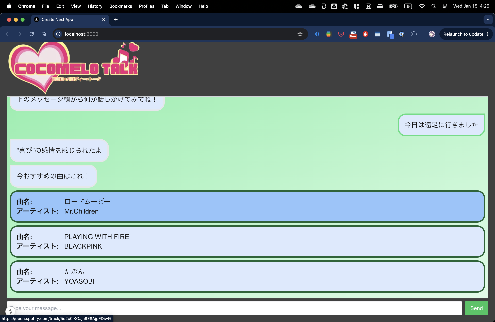

# Cocomelo Talk

同志社大学理工学研究科

知識情報処理特論 2024 年 3 班

## How To Use

### セットアップ

- [モデルのダウンロード (Google ドライブ)](https://drive.google.com/drive/folders/1YmF_3TihtXOEELXUr_ShG1kT4rIIzgef?usp=sharing)を行い、`backend/trained_model`に置いてください。(※ 基本的には自動的にダウンロードが行われます。 エラーが発生する場合のみ手動でダウンロードを行なってください)
- `$ docker-compose up --build` コマンドでフロントエンド、バックエンドが立ち上がります。
- [localhost:3000](http://localhost:3000)にアクセスしてください。

### 画面の説明

1. [localhost:3000](http://localhost:3000)にアクセスすると下のような画面が表示されます。
   

1. 下の`Type your message...`とある部分にテキストを入力し、`Send`ボタンを押すことでメッセージを送信できます(Enter でも可能)。

1. サーバーから推定された感情に合わせておすすめのメッセージが送信されます。
   

1. 曲が表示されている部分をクリックすることで Spotify の該当する曲の画面に飛ぶことができます。
   
